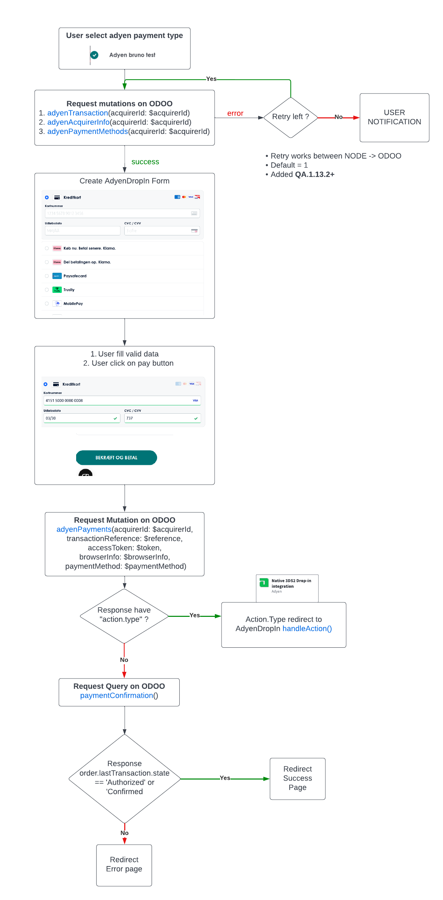

# Greenmind

Hos GreenMind finder du secondhand elektronik med 3 års garanti. Køb brugt elektronik til fordelagtige priser og gør en forskel for miljøet.

## How to start?

```sh
1. git clone https://git.odoogap.com/customer-projects/greenmind
2. yarn install
3. yarn build # (required) GreenMind project need build to fetch dinamic routes from ODOO
4. yarn dev
5. You can access with http://localhost:3000
6. Or yarn dev-default
```

## Api cache
The redisClient configuration in middleware.config.js enable this feature.
It is true because make development faster. If need flush your local redis.

## Odoo image resize list (if loose the data)

[25, 57, 70, 82, 104, 125, 140, 160, 171, 206, 206, 216, 236, 248, 288, 300, 326, 375, 442, 442, 442, 446, 496, 500, 507, 547, 660, 664, 664, 680, 800, 816, 1332, 1440]

## Env vars used


```bash
PORT - node port
HOST - netork interface
NODE_ENV - for enviroments
NODE_LOCALE - for translations
BASE_URL - for odoo backend api
BACKEND_BASE_URL - for odoo backend api through local network (NOT currently being used in Production)
PUBLIC_PATH - for CDN url
SITE_URL - for sitemap host url
NODE_LOG_LEVEL - for the log level ( INFO is default, TRACE for full log information, print all debug needs)
LOG_BROWSER_IN_API - log the browser errors in the backend, http request ( high cost ) only using in homepage
BASE_DOMAIN - to build routes, redirects (sended in request-host to enable multi language)
# Third party systems
COOKIEBOT_KEY - key for cookiebot (default d2da6edf-44b1-4063-a6ef-fe4f37edeb0c)
INVALIDATION_KEY - token to refresh aplication (default 0ead60c3-d118-40be-9519-d531462ddc60)
KLAVIYO_KEY - key for klaviyo (default NzYWAu)
GTAG_KEY - key for google tags (default G-YYZ9TG2MS2)
GTM_KEY - key for google tag manager (default GTM-K9V7Q37)
CLERK_PUBLIC_KEY - key for clerk io
# Redis
REDIS_HOST - redis server host
REDIS_PORT - redis server port
REDIS_PASSWORD - redis server password
REDIS_DATABASE - redis server database
# Storyblok
SB_TOKEN - Api Key to connect app with storyblok
SB_MODE  - Storyblok working mode. Values: ( draft, published ) https://www.storyblok.com/docs/api/content-delivery#core-resources/stories/retrieve-one-story
```

## Env vars set for dev build

```bash
export CLERK_PUBLIC_KEY=CEhYajX1WwY3uAClBKte5UC6qAC6d7W1
export COOKIEBOT_KEY=d2da6edf-44b1-4063-a6ef-fe4f37edeb0c
export GTAG_KEY=G-YYZ9TG2MS2
export GTM_KEY=GTM-K9V7Q37
export KLAVIYO_KEY=NzYWAu
export NODE_LOCALE=en-EN
export PUBLIC_PATH=http://localhost:3000/_nuxt/
export SITE_URL=https://vue-dev.greenmind.space/
export INVALIDATION_KEY=0ead60c3-d118-40be-9519-d531462ddc60
export SITEMAP_CACHE=6000
export BACKEND_BASE_URL=https://web-dev.greenmind.space/
export BASE_URL=https://web-dev.greenmind.space/
export BASE_DOMAIN=http://localhost:3000/
export SB_TOKEN=0vS0uwQC7Ym1Wuf2siDT6gtt
export ROBOTS=1
export LOG_BROWSER_IN_API=false
export SB_MODE=draft
export REDIS_HOST=localhost
export REDIS_PORT=6379
export REDIS_PASSWORD=123
export REDIS_DATABASE=0
export REDIS_TTL_CACHE_MINIMUM=3600
export REDIS_TTL_CACHE_MAXIMUM=7200

```

## Adyen direct flow



